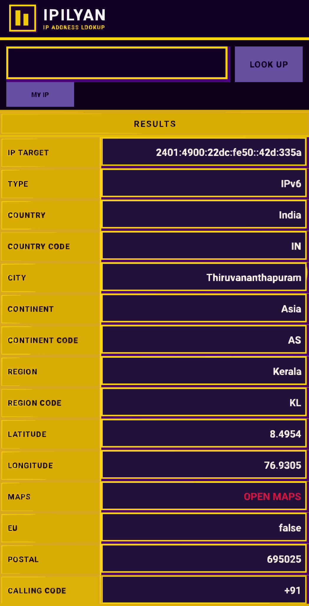

# IPILYAN

**IP ADDRESS LOOKUP — MAXIMALISM UI**

<p align="center">
  
</p>

<p align="center">
  <b>Enter any IP or domain → see 27+ details instantly.</b><br>
  Built with Kotlin for Android (API 26+).
</p>

<p align="center">
  <a href="#-download">📥 Download</a>
  ·
  <a href="#-features">Features</a>
  ·
  <a href="#-build">Build</a>
  ·
  <a href="#-license">License</a>
</p>

---

## 📥 Download

| Version | APK |
|---------|-----|
| **v1.1.0** | [Download APK](https://github.com/ilhandv123/Ipilyan/releases/latest) |

---

## ✨ Features

- **27 IP details** — IP Target, Type, Country, City, Continent, Region, Lat/Lon, Maps, EU, Postal, Calling Code, Capital, Borders, Flag, ASN, ORG, ISP, Domain, Timezone, DST, Offset, UTC, Current Time
- **MY IP button** — auto-detect your own public IP
- **Maps integration** — tap to open Google Maps at the IP's coordinates
- **Maximalism UI** — deep purple & gold gradients, ornate borders, jewel tones, luxurious feel
- **Crash handler** — saves logs with device info, one-tap copy to clipboard
- **Landscape support** — dedicated side-by-side layout
- **Dual API fallback** — ipapi.co + ip-api.com for maximum reliability
- **Low-end optimized** — runs smoothly on older devices

---

## 📸 Screenshot

<p align="center">
  
</p>

---

## 🔧 Build

```bash
git clone https://github.com/ilhandv123/Ipilyan.git
cd Ipilyan
./gradlew assembleRelease
```

APK output: `app/build/outputs/apk/release/app-release.apk`

### Requirements

- Android Studio / AndroidPE
- JDK 17+
- Android SDK 36

---

## 🏗️ Tech Stack

| Component | Library |
|-----------|---------|
| Language | Kotlin 2.3.0 |
| UI | Material 3 + custom Maximalism drawables |
| Networking | `HttpURLConnection` (no third-party deps) |
| API | ipapi.co + ip-api.com |
| Build | Gradle 9.1 + AGP 8.13.2 |
| Min SDK | 26 |
| Target SDK | 35 |

---

## 📄 License

```
MIT License

Copyright (c) 2026 ilhandv123

Permission is hereby granted, free of charge, to any person obtaining a copy
of this software and associated documentation files (the "Software"), to deal
in the Software without restriction, including without limitation the rights
to use, copy, modify, merge, publish, distribute, sublicense, and/or sell
copies of the Software, and to permit persons to whom the Software is
furnished to do so, subject to the following conditions:

The above copyright notice and this permission notice shall be included in all
copies or substantial portions of the Software.

THE SOFTWARE IS PROVIDED "AS IS", WITHOUT WARRANTY OF ANY KIND, EXPRESS OR
IMPLIED, INCLUDING BUT NOT LIMITED TO THE WARRANTIES OF MERCHANTABILITY,
FITNESS FOR A PARTICULAR PURPOSE AND NONINFRINGEMENT. IN NO EVENT SHALL THE
AUTHORS OR COPYRIGHT HOLDERS BE LIABLE FOR ANY CLAIM, DAMAGES OR OTHER
LIABILITY, WHETHER IN AN ACTION OF CONTRACT, TORT OR OTHERWISE, ARISING FROM,
OUT OF OR IN CONNECTION WITH THE SOFTWARE OR THE USE OR OTHER DEALINGS IN THE
SOFTWARE.
```

---

<p align="center">
  <b>IPILYAN</b> · IP ADDRESS LOOKUP · MAXIMALISM<br>
  <sub>Powered by <a href="https://ipapi.co">ipapi.co</a> & <a href="http://ip-api.com">ip-api.com</a></sub>
</p>
